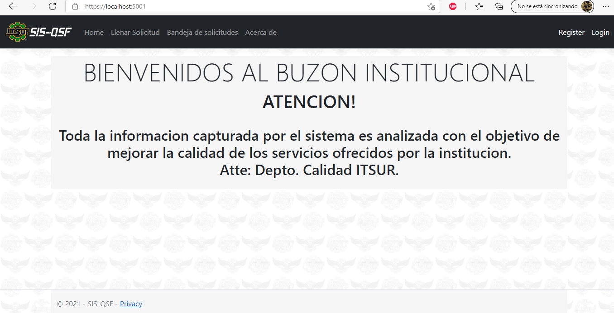

<h1>Sistema Buzon de Quejas, Sugerencias y/o Felicitaciones - SISQSF.</h1>

El SISQSF es un sistema tipo buzon desarrollado en ASP.NET Core 5 para el Instituto Tecnologico Superior del Sur de Guanajuato - ITSUR. Desarrollado con el objetivo de atender y dar seguimiento a todas aquellas quejas que ayuden a la institucion a mejorar la calidad de sus servicios.

El sistema estilo CRUD se conforma de lo siguiente: *ASP.NET Core MVC 5. *ASP.NET Core Identity. *ASP.NET Core Authorization & Authentication. *Desplegado en Microsoft Azure Web Services.

El sistema por su lado maneja: *Gestion de autenticacion y roles de usuarios. *Emitir una solicitud, queja o sugerencia. *Subir evidencias. *Funciones de Crear, Eliminar, Editar y Actualizar.
 

<strong>Inicio</strong>

